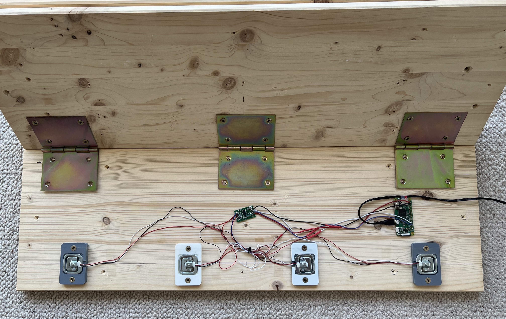

# smartHangboard

This is a project to measure finger strength. The hangboard uses body weigth scale sensors that are connected to a full bridge. The signal is amplified using a HX711 load cell amplifier and further processed in a python script running on a Raspberry Pi Nano.

A demonstration can be found here: [https://www.youtube.com/watch?v=Jod9fljPiQs](https://www.youtube.com/watch?v=Jod9fljPiQs)

